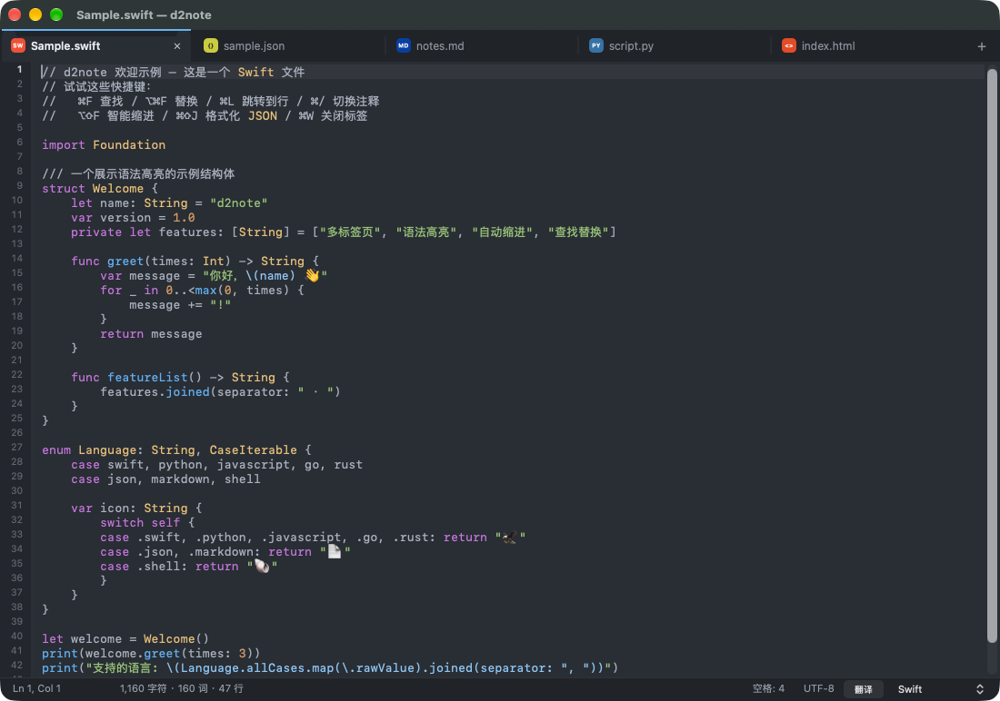

# d2note

一个用 **Swift + AppKit** 原生编写的 macOS 轻量笔记/代码编辑器（🐰 d2note），向 Notepad++ 致敬。
单窗口多标签，打开即用，无任何第三方依赖，深度集成系统能力与本地智能。



## ✨ 功能

- **多标签页**：可拖拽排序、双击空白新建、`⌘1-9` 快速切换、修改标记（•）
- **语法高亮**：手写 UTF-16 tokenizer，支持 20 种语言
  （Swift / Python / JS / TS / C / C++ / C# / Java / Go / Rust / Ruby / PHP / JSON / XML / HTML / CSS / Markdown / YAML / Shell / SQL）
- **自动识别语言**：按扩展名判断，无扩展名时根据 shebang / 内容嗅探；状态栏可手动切换
- **快速格式化**：JSON 格式化 / 压缩、XML/HTML 美化 / 压缩、SQL 美化（子句换行 + 关键字大写）、
  智能缩进（括号深度感知，跳过字符串）、排序所选行、行倒序、去除重复行、删除空行、
  大小写转换、制表符转空格、去除行尾空白
- **中文右键菜单**：剪切/拷贝/粘贴/删除/全选 + 切换注释、翻译、格式化、排序去重、跳转一行直达
- **编辑辅助**：
  - 回车自动缩进（括号间回车自动三行展开）
  - 括号 / 引号自动补全与跳过、选中文本包裹
  - 括号配对高亮、当前行高亮
  - `Tab` / `Shift+Tab` 批量缩进、`⌘/` 切换注释
- **查找替换**：支持正则、大小写开关、上一个 / 下一个 / 单个替换 / 全部替换
- **跳转到行**（`⌘L`）、字数统计、行号栏（可关）
- **深色 / 浅色主题**（One Dark / Xcode 风格），字号快捷调节
- **文件处理**：拖拽打开、最近打开、UTF-8 / UTF-16 / Latin-1 自动识别（保留 BOM）、二进制文件检测
- **系统集成**：Dock 菜单（新建/打开/最近文件）、Dock 徽标（未保存标签数）、
  系统服务「用 d2note 打开所选文本」、全屏支持、拖拽打开、"打开方式"注册、
  标题栏代理图标（可拖拽引用文件）
- **自动保存草稿**（默认开启）：未命名标签内容、已打开文件的未保存修改、
  光标位置、标签顺序与激活状态，全部持久化到
  `~/Library/Application Support/d2note/session.json`，重启后完整恢复；
  文件被删除时草稿会以"已恢复"标签救回。可在偏好设置中关闭
- **本地翻译**（🇨🇳 macOS 26+）：基于系统 Translation 框架的完全离线翻译，
  `NLLanguageRecognizer` 自动识别源语言、自动选择目标语言，首次使用引导下载语言包
- **智能推荐**（默认关闭）：本机习惯学习引擎，`NLTokenizer` 分词记录你的常用词句，
  输入时以灰色"幽灵文本"提示补全，`Tab` 接受、`Esc` 关闭；数据仅存本机
- **赛博霓虹兔图标**（SVG 手绘：霓虹描边 + 发光滤镜 + 电路走线，qlmanage 渲染管线）
- **标签页文件类型徽标**：GitHub Linguist 配色的 21 色语言徽章，悬停显示完整路径
- **命令面板**（`⌘⇧P`）：模糊搜索全部 28 条命令，键盘直达

## 🚀 构建与运行

```bash
cd SwiftPad
bash make_app.sh          # 编译并打包成 build/SwiftPad.app
open build/SwiftPad.app   # 运行
```

开发调试（带示例文件启动）：

```bash
swift build
.build/debug/SwiftPad --demo          # 打开内置示例
.build/debug/SwiftPad --open a.py b.c # 从命令行打开文件
```

重新生成应用图标（可选，需重新打包）：

```bash
swift tools/MakeIcon.swift
iconutil -c icns build/icon.iconset -o build/SwiftPad.icns
bash make_app.sh
```

## ⌨️ 快捷键

| 功能 | 快捷键 |
|------|--------|
| 新建标签 | `⌘N` |
| 打开文件 | `⌘O` |
| 保存 / 另存为 / 保存全部 | `⌘S` / `⌘⇧S` / `⌥⌘S` |
| 关闭标签 | `⌘W` |
| 查找 / 替换 | `⌘F` / `⌥⌘F` |
| 查找下一个 / 上一个 | `⌘G` / `⌘⇧G` |
| 跳转到行 | `⌘L` |
| 切换注释 | `⌘/` |
| 格式化文档（智能缩进） | `⌥⇧F` |
| 格式化 JSON | `⌘⇧J` |
| 自动换行 / 行号 | `⌥⌘W` / `⌥⌘L` |
| 切换标签 | `⌘⇧[` `⌘⇧]`、`⌘1-9` |
| 字号 | `⌘=` `⌘-` `⌘0` |
| 翻译全文 / 所选 | `⌥⌘T` |
| 偏好设置 | `⌘,` |

## 📁 结构

```
Sources/SwiftPad/
├── main.swift               # 入口
├── AppDelegate.swift        # 窗口 / 菜单 / 标签管理 / 文件 IO / 查找替换
├── EditorTextView.swift     # NSTextView 子类：自动缩进、括号配对、当前行/括号高亮
├── Highlighter.swift        # 手写 tokenizer + 20 种语言定义
├── SourceLanguage.swift     # 语言枚举与自动检测
├── Formatter.swift          # JSON / XML / 智能缩进格式化
├── TabBarView.swift         # 自绘标签栏（拖拽排序）
├── LineNumberRulerView.swift# 行号标尺
├── FindBarView.swift        # 查找替换栏
├── StatusBarView.swift      # 状态栏 + 跳转到行栏
├── SettingsSheet.swift      # 偏好设置
├── Theme.swift              # 主题（One Dark / Xcode Light）
├── EditorDocument.swift     # 文档模型（行缓存、行列计算）
└── SampleContent.swift      # 首次启动示例
```

## 说明

- 首次启动会打开内置示例标签页；之后每次启动是空白新标签
- 本地翻译需要 macOS 26+（系统 Translation 框架）；低版本自动禁用该按钮
- `make_app.sh` 使用 ad-hoc 签名，可直接分发
